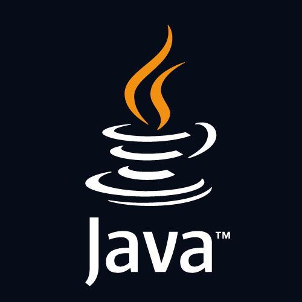

# Базовые знания

## Знакомство с языком
Java - ООП язык, со статической типизацией. Его особенностью является то, что код, написанный на этом языке
будет запускаться на любом устройстве (необязательно компьютере). 



## Первая программа
Каждая программа в java должна содержать хотя бы **один класс** и **точку входа**.
На рисунке ниже показан пример минимальной программы на java.

```java
// файлы на языке java имеют расширение .java
// объявление класса
public class Main {

  // точка входа в программу
  public static void main(String[] args) {
    System.out.println("Hello world");
  }

}
```

Как мы видим, здесь присутствует один класс (Main) и точка входа (main)
Класс Main можно назвать как угодно, но точка входа в программу всегда должна иметь имя main.

Конструкция `System.out.println("Hello World")` выведен на консоль надпись `Hello World".

## Базовые конструкции
К базовым конструкциям языкам относятся, переменные, условия и циклы.
Java по своему синтаксису очень похож на Си-подобные языки (C, C++, C#, PHP, Javascript и.т.д).
Поэтому тем, кто знаком хотя бы с одним из этих языков будет очень просто "вкатиться" в синтаксис 
джавы.

### Переменные
Переменные объявляются по следующему правилу: 
> <тип> <имя_переменной> = <значение_переменной>
 
Пример:
```java
int minutes = 30;
double PI = 3.14;
String hello = "Hello"
```
На примере выше объявлены 3 переменные, у них тип int, double и String соответственно.
minutes, PI, hello - имена этих переменных. Переменные могут состоять из латинских букв, цифр 
(но не должны начинаться с цифры). Чаще всего имя переменных - это обычные английские слова,
передающие смысл того, что в ней хранится.

Теперь немного поговорим о типах данных. Начнем с примитивных

#### Примитивные типы данных
```
Целые типы - byte, short, int, long
Числа с плавающей точкой - float, double
Логический тип - boolen 
Символьный тип - char 
```

Значениями целых типов данных является число (например 100),
Числами с плавающей точкой - число с дробью (например 3.14).
У логического типа всего два значения: правда (true) и ложь (false)
Символьный тип способен хранить лишь одно символьное значение (например 'a' или 'b').
Одинарные кавычки обязательны, иначе язык не поймет, что это символ.

### Ссылочные типы данных
Ссылочные типы данных - типы данных, которые состоят из примитивных.
Ссылочных типов огромное кол-во, потому что любой человек в любой момент времени может написать свой тип данных, на основе других типов.
К счастью их не нужно запоминать как примитивные типы, нужно знакомиться с ними по мере необходимости.
Сейчас познакомимся с самым основным ссылочным типом данных - String.


String - ссылочный тип данных, представляющий строки. 
В переменную типа String можно записать любую строку. Например:
```java
//двойные кавычки обязательны (не путать с одинарными)
String message = "Hello world"
String fullName = "Ivanov Ivan Ivanovich"
```
Пока это все типы данных, про которые вам необходимо знать.
Мы будем изучать больше по мере необходимости.

### Классы
Класс - элемент ПО, описывающий абстрактный тип данных, и его частичную или полную реализацию

Другими словами - класс свой тип данных (такой, как int, double, float).
Классы могут не полностью реализовывать свой функционал, а оставить его реализацию своим потомкам (абстрактные классы),
но могут и реализовать ее, чтобы создать самодостаточный тип данных, который может использоваться в 
программе.

```java
// пример абстрактного класса
public abstract class Animal {
  private String name;
  
  public class Animal(String name) {
    this.name = name;
  }
  
  public String getName() { return name; }
  public void setName(String name) { this.name = name; }
}
```

Экземпляры абстрактных классов не могут быть созданы в приложении (потому что сам по себе абстрактный 
класс является незаконченным типом данных). 


Классы могут наследоваться от других классов, создавая иерархию.
Потомок класса забирает функционал базового, т.е ему не надо еще раз писать код в своей реализации.

Также наследование открывает дорогу еще одному важнейшей черте ООП - полиморфизму, о котором мы поговорим отдельно.

### Интерфейсы
Интерфейс - набор публичных методов, который берется на себя реализовать класс его реализующий(имплементирующий).
Если класс реализует какой-то интерфейс, то мы со 100% уверенностью можем судить, что у него будут те же методы,
что и у этого интерфейса. Еще можно рассматривать интерфейс как контракт.

```java
public interface Printable {
  void print();
}
```

Здесь класс, реализующий метод print обязан будет переопределить метод print.

[Перейти к коду](./src/main/java/)